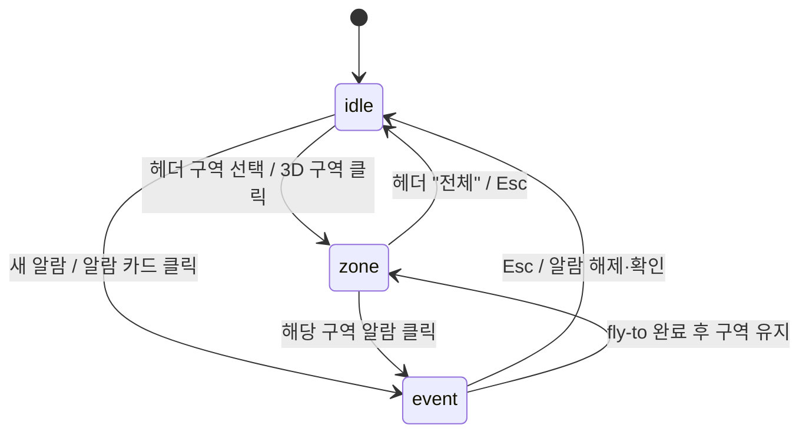
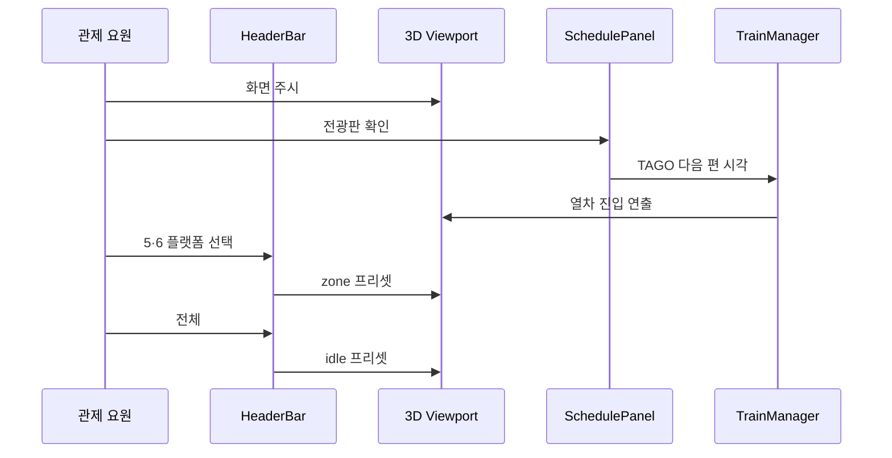
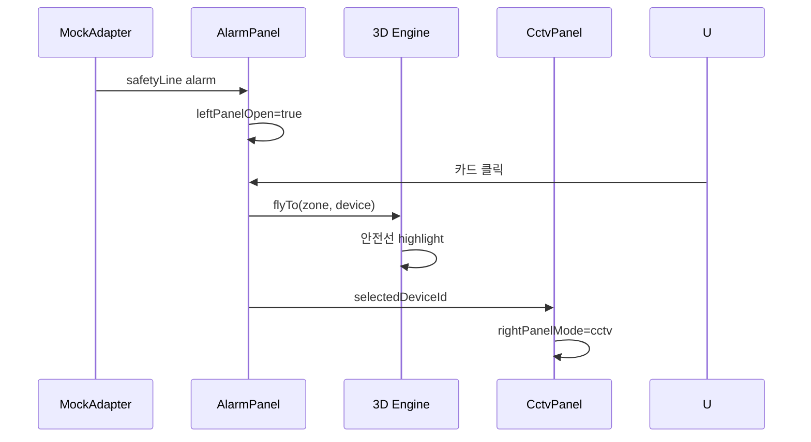

# 03. UX / 화면 설계

> **문서 유형:** 프론트엔드 2단계 산출물  
> **근거:** `01-요구사항-범위-고정.md`, `02-타사-PoC-분석.md`  
> **목적:** 구현 전에 *관제 요원이 실제로 어떻게 쓰는지* → *화면·패널·상태*로 고정  
> **다음 단계:** 본 문서 기준으로 `ControlShell`·패널·`uiStore` 구현

---

## 0. 왜 이 문서가 중요한가

타사 PoC는 **기능은 많았지만 UX·디지털 트윈 체감**에서 부족한 것으로 보인다.  
우리 PoC는 **탭·화면 수**가 아니라 **S1~S3 플로우가 끊김 없이** 동작하는지가 핵심이다.

| 잘못하면 | 잘하면 |
|---------|--------|
| 타사처럼 좌·우·CCTV 4칸 풀가동 | **3D full-bleed 고정** + 패널만 **플로팅 오버레이** (Push 금지) |
| 알람·3D·영상이 따로 놀음 | 클릭 1번 → fly-to → CCTV 1채널 |
| Figma 없이 코드부터 | **상태·와이어 합의 후** 컴포넌트 단위 구현 |

---

## 1. 사용자

### 1.1 주 사용자: 역사 관제 요원

| 항목 | 내용 |
|------|------|
| **역할** | 서울역 혼잡·안전·시설 이상 **실시간 감시** |
| **환경** | 관제실 **대형 모니터** 1920×1080+, PC, Chromium (**1차**) |
| **부가 환경** | **Samsung Galaxy Tab S9** 가로, Chrome/Samsung Internet (**2차·실기 검증**, `01` §8.1) |
| **동시 작업** | 여러 구역 상태 훑기 → 이상 시 **해당 위치 확인** |
| **기대** | “어디서 무슨 일”을 **3D에서 바로** 알 수 있음 |
| **비기대** | Excel·설정·카메라 XYZ 입력 (프로젝트/백오피스) |

PoC 화면은 **관제 요원 1순위**, 시연 검증은 **S1~S3 플로우** 기준.

---

## 2. 화면 범위 (PoC)

### 2.1 P0: 단일 화면 — **실시간 관제**

타사 6탭 중 **이 화면만** P0에서 완성한다.

| 포함 | 제외 (P1~P2) |
|------|-------------------|
| 실시간 3D + **플로팅** 패널 | 확인 대기 **탭** (P2) |
| 알람 · TAGO · CCTV 1채널 + 인근 썸네일 | CCTV **그리드 탭** (P2) |
| **화장실 재실** · 성능 위젯 | 히스토리 탭 (P2) |
| | 설정 탭 — `devices.json` + 프로젝트 **3D Drag & Drop** (P2, §5.6) |

### 2.2 P1: 동일 셸 내 **패널 확장**

| 추가 UI | 방식 |
|---------|------|
| 히트맵 | 우측 패널 **탭/섹션** 전환 |
| 통계 차트 + CSV | 헤더 **모달** 또는 우측 패널 전환 (별도 탭 아님) |
| 자산 검색 | 좌측 알람 패널 상단 검색 |

**원칙:** P1도 **URL 탭 6개**로 늘리지 않는다. 한 셸 안에서 패널 콘텐츠만 늘린다.

### 2.3 레이아웃 원칙 — Floating Overlay (§4.4-2)

관제 요원은 대형 모니터를 **멀리서** 오래 본다. 패널이 열릴 때 3D가 줄어들거나(Push) 레이아웃이 밀리면 **시각 피로**가 크다.

| Push (금지) | Floating Overlay (P0) |
|---------------|-------------------------|
| 패널 열림 → 3D viewport 폭·스케일 축소 | **3D canvas 크기·위치 항상 고정** (헤더 아래 full-bleed) |
| flex/grid로 좌·중·우 3열 재배치 | 반투명 **글래스 패널**만 좌·우·상단에 **겹침** |
| 패널 토글 시 화면이 덜컹거림 | 패널만 `transform`/`opacity`로 슬라이드 — **3D는 안 움직임** |

**스타일 (Tailwind + gc-twin-ops 패턴):**

- UI 컴포넌트: **Tailwind 유틸리티** (`cn()` + `tailwind-merge`)
- 레이아웃 셸·오버레이: `global.css` + `@theme` 토큰 (아래 구조)

```text
.app-shell
├── .app-shell__header          … 고정 44px
├── .app-shell__viewport        … position:absolute; inset:0 (헤더 제외) — 3D full-bleed
└── .app-shell__overlay         … pointer-events:none; 패널 콘텐츠만 auto (§11.1)
    ├── .overlay-panel--left
    └── .overlay-panel--right
```

**NF-10 해석:** “3D 70% 이상”은 **Push로 3D를 줄이는 것**이 아니라, **패널을 접어 3D가 가려지지 않게** 하는 것. 패널이 열려도 3D **canvas 영역은 변하지 않음**.

---

## 3. 정보 구조 (IA)

### 3.1 화면 계층

```text
앱
└── 실시간 관제 (P0 유일 화면)
    ├── HeaderBar          … 역·시계·구역·KPI·배지 (고정)
    ├── Viewport (3D)      … 역사·열차·마커·안전선 — **full-bleed, 항상 동일 영역**
    ├── Overlay (floating) … pointer-events 분리
    │   ├── PanelLeft      … 알람 리스트
    │   └── PanelRight     … 전광판 | CCTV | 재실
    └── PerfWidget         … FPS · draw · tris (viewport 위 좌하)
```

### 3.2 패널별 책임 (무엇을 어디에)

| 영역 | ID | 콘텐츠 | 데이터 | 갱신 |
|------|-----|--------|--------|------|
| **헤더** | `HeaderBar` | 역명, 시계, **구역 프리셋**, 미확인 알람 수, Live/Mock 배지 | Config, uiStore | 1s |
| **좌** | `AlarmPanel` | 알람 카드 리스트, 심각도 필터, (P1) 검색 | MockRailwayAdapter | WebSocket 대체 → interval |
| **중** | `ThreeViewport` | 매스, 구역, 열차, 안전선, **최소 마커** | Engine | rAF |
| **우** | `SchedulePanel` | TAGO 출발/도착, 차종 필터, 새로고침 | TagoTrainClient | 수동+주기 |
| **우** | `CctvPanel` | **1채널** + 인근 **2~3 썸네일**, (P1) AI 오버레이 | Mock | 이벤트 연동 |
| **우** | `RestroomPanel` | 칸별 재실·위급 (**P0**, S3) | Mock | interval |
| **하** | `PerfWidget` | FPS, draw calls, triangles | Engine | rAF |

### 3.3 우측 패널 모드 (우선순위)

한 번에 **하나의 주 모드**만 크게 보여준다.

| 우선순위 | 모드 | 트리거 |
|----------|------|--------|
| 1 | **CCTV** | 알람 선택 · 3D 카메라 클릭 · 안전선 이벤트 |
| 2 | **재실** | 화장실 위급 알람 · 화장실 구역 진입 |
| 3 | **전광판** | 평시 · Esc · CCTV 닫기 |

```text
[평시]     우측 = 전광판 (넓게) + CCTV 슬롯 접힘
[이벤트]   우측 = CCTV 1채널 (넓게) + 전광판 축소(한 줄 또는 접기)
```

---

## 4. 화면 상태 (State Machine)

관제 화면은 **4가지 상태**만 가진다. `uiStore`에 매핑한다.

| 상태 | 코드명 | 3D | 좌 패널 | 우 패널 | 헤더 |
|------|--------|-----|---------|---------|------|
| **A. 평시** | `idle` | 전체 뷰 | 접힘 또는 좁음 | 전광판 열림 | 구역: 전체 |
| **B. 구역** | `zone` | 구역 프리셋 | (선택) 열림 | 전광판 | 구역: 환승/화장실/5·6 |
| **C. 이벤트** | `event` | fly-to 중·완료 | **열림**, 해당 카드 강조 | **CCTV 1채널** | 미확인 N |
| **D. 이벤트+구역** | `event+zone` | 구역 상세 + 하이라이트 | 열림 | CCTV 또는 **재실** | 구역 고정 |

### 4.1 상태 전이



### 4.2 uiStore 초안 (구현 계약)

| 필드 | 타입 | 설명 |
|------|------|------|
| `leftPanelOpen` | boolean | 좌 알람 패널 |
| `rightPanelMode` | `'schedule' \| 'cctv' \| 'restroom'` | 우측 주 모드 |
| `rightPanelOpen` | boolean | 우 패널 (접이) |
| `selectedZoneId` | string \| null | `transfer` \| `restroom` \| `platform-56` \| null=전체 |
| `selectedAlarmId` | string \| null | 포커스 중 알람 |
| `selectedDeviceId` | string \| null | CCTV 등 |
| `cameraPreset` | string | Engine fly-to 대상 |
| `isPointerOverPanel` | boolean | 패널 인터랙티브 영역 hover — 3D Orbit 충돌 방지 (§11.1) |

**규칙**

- `selectedAlarmId` 설정 시 → `rightPanelMode = 'cctv'`, `leftPanelOpen = true`
- `Esc` → `selectedAlarmId` 해제, `rightPanelMode = 'schedule'` (3D는 zone 유지 또는 전체)
- 평시 데모 시작 → `idle`, 좌·우 **접힘** 권장

---

## 5. 사용자 시나리오 → 화면 플로우

### 5.1 Flow A — 평시 관제 (S1)

**목표:** “살아 있는 철도 역사” — TAGO + 열차 연출

| 단계 | 요원 행동 | 화면 변화 |
|------|-----------|-----------|
| A1 | 모니터 확인 | `idle`, 3D 전체 뷰, 패널 접힘, 성능 위젯 표시 |
| A2 | 우측 전광판 펼침 (또는 기본 열림) | `rightPanelMode=schedule`, TAGO 목록 |
| A3 | 다음 도착 열차 확인 | 목록 상단 강조, 3D 해당 선로에 열차 접근 |
| A4 | (선택) 5·6 플랫폼 클릭 | `zone`, 카메라 프리셋 전환, 안전선 mesh 보임 |
| A5 | 전체로 복귀 | 헤더 「전체」→ `idle` |



---

### 5.2 Flow B — 안전선 침범 (S2)

**목표:** 알람 1건이 **3D·영상까지** 끊김 없이 이어짐

| 단계 | 요원 행동 | 화면 변화 |
|------|-----------|-----------|
| B1 | 평시 감시 | `idle` |
| B2 | (시스템) 안전선 침범 Mock | 좌 패널 **자동 펼침**, 카드 1건 추가, 헤더 미확인 +1 |
| B3 | 3D 확인 | 해당 구역 마커 **펄스**(플로팅 % **없음**) |
| B4 | 알람 카드 클릭 | `event`, fly-to 시작, 안전선 **적색** 강조 |
| B5 | 영상 확인 | 우측 **CCTV 1채널** + **인근 2~3 썸네일** |
| B6 | (선택) 확인 | 카드 「확인」→ 미확인 감소 (P1: 히스토리 연동) |
| B7 | 복귀 | `Esc` → `idle` 또는 `zone` |

**금지 (타사 패턴):** B4에서 우측에 CCTV 3칸 동시 표시, 3D에 「391%」 플로팅.



---

### 5.3 Flow C — 구역 드릴다운 (F-03)

**목표:** 전체 → 세부 (견적 스펙 「전체 뷰 → 구역 상세」)

| 진입 | 동작 | 결과 |
|------|------|------|
| 헤더 칩 | `전체` `환승통로` `화장실` `5·6플랫폼` | 즉시 카메라 프리셋 |
| 3D 클릭 | 구역 mesh 피킹 | 동일 + 헤더 칩 sync |
| 미니맵 (P2) | — | 보류 |

| 구역 ID | 프리셋 | 3D에서 강조 |
|---------|--------|-------------|
| `overview` | 전체 조망 | 전역 |
| `transfer` | 2층 환승통로 | 환승 매스 |
| `restroom` | 2층 남자 화장실 | 화장실 구역 |
| `platform-56` | 1층 5·6번 | 플랫폼 + **안전선** |

---

### 5.4 Flow D — 화장실 위급 (S3, **P0**)

| 단계 | 화면 |
|------|------|
| D1 | Mock 위급 알람 |
| D2 | 알람 클릭 → fly-to `restroom` |
| D3 | 우측 `restroom` 모드 — 칸별 재실, 위급 칸 강조 |
| D4 | (선택) CCTV 1채널 |

S2와 **동일 패턴** — 우측만 재실 패널로 바뀐다.

---

### 5.5 데이터 정규화 레이어 (NF-09, §4.4-1)

타사의 391%는 UI 실수만이 아닐 수 있다. 현장 AI 카메라가 **설계 기준 인원 대비 Raw 비율**을 그대로 보내고, 타사는 **가공 없이** 화면에 뿌린 것으로 보인다.

**우리 처리 (구현: `adapters/normalize.ts`):**

```text
현장 Raw (300%+)  →  Adapter 정규화  →  UI (0~100% 또는 여유/주의/심각)
```

| UI 위치 | 표기 규칙 |
|---------|-----------|
| 알람 카드 | 4단계 뱃지 + (선택) 0~100% — **100% 초과 금지** |
| 3D | 색·펄스만 — **플로팅 % 금지** |
| 히트맵 (P1) | NF-09 색 스케일 |

---

### 5.6 설정 탭 제외 — 노코드 편집 (P2, §4.4-3)

PoC는 **`devices.json`**으로 카메라·센서 좌표를 관리한다. 설정 **화면은 만들지 않는다.**  
프로젝트에서는 **3D Drag & Drop 노코드 편집** (`F-22`)으로 확장 — 타사 설정 탭(XYZ·go2rtc 수동 입력) 대체.

---

## 6. 와이어프레임 (ASCII)

Figma 목업 전 **구현 합의용** 와이어. 픽셀·색은 `global.css` `@theme` 토큰 따름.

### 6.1 상태 A — 평시 (`idle`)

3D는 **항상 전체 영역**. 패널은 그 위에 **반투명으로 겹침**.

```text
┌──────────────────────────────────────────────────────────────────────────┐
│ 서울역 관제  16:42:03   [전체][환승][화장실][5·6]   미확인 0   Live·TAGO │  ← Header (고정)
├──────────────────────────────────────────────────────────────────────────┤
│                                                                          │
│  ▌알▌                                                                    │
│  ▌람▌              3D VIEWPORT — full-bleed (크기 고정)                   │
│  ▌ ‹▌              역사 매스 · 열차 · 최소 마커                           │
│                    (패널 열어도 3D 영역은 안 줄어듦)                       │
│                                                                          │
│  ┌ FPS 58 · DC 142 · 89k ┐                          ┌──────────────────┐ │
│  └ (좌하 PerfWidget)      ┘                          │ 열차 전광판      │ │
│                                                     │  KTX …           │ │
│                                                     │  ITX …           │ │
│                                                     │  ‹ 접기          │ │
│                                                     └ (우측 floating) ─┘ │
└──────────────────────────────────────────────────────────────────────────┘
```

- 좌 `‹` : 접힌 탭 — 클릭 시 알람 패널 **슬라이드 인** (3D 밀리지 않음)  
- 우 : 전광판 기본, CCTV 영역은 **접힌 채** 또는 하단 1줄 placeholder

---

### 6.2 상태 C — 이벤트 (`event`)

```text
┌──────────────────────────────────────────────────────────────────────────┐
│ 서울역 관제  16:43:12   [5·6플랫폼]              미확인 1   Live·TAGO   │
├──────────────────────────────────────────────────────────────────────────┤
│ ┌─────────────┐                                                            │
│ │ 알람 (1)    │         3D — full-bleed (동일 영역, fly-to 완료)          │
│ │─────────────│         안전선 ███ 적색 강조                               │
│ │▶ 안전선 침범 │         카메라 아이콘 1개                                  │
│ │  5·6 플랫폼  │         (좌·우 패널이 3D 위에 겹침)                        │
│ │  긴급 · 0:12│                                                            │
│ └─────────────┘                              ┌──────────────────────────┐  │
│                                              │ CCTV                     │  │
│                                              │ ┌────────────────────┐   │  │
│                                              │ │ video 1채널          │   │  │
│                                              │ └────────────────────┘   │  │
│                                              │ 안전선-06 · [전체화면]   │  │
│                                              └ (우측 floating) ─────────┘  │
└──────────────────────────────────────────────────────────────────────────┘
```

- 알람 카드 **좌측 강조 테두리** (`--color-accent`)  
- 전광판은 **접힘** 또는 상단 40px 요약 한 줄

---

### 6.3 상태 B — 구역 (`zone`)

```text
┌──────────────────────────────────────────────────────────────────────────┐
│ … [전체][환승][화장실][●5·6] …                                           │
├──────────────────────────────────────────────────────────────────────────┤
│                                                                          │
│     3D — full-bleed, 플랫폼 클로즈업, 안전선 노란 라인                    │
│     (좌 접힘) 열차 정차 연출 가능                                         │
│                                                                          │
│                                    ┌──────────────────────────────────┐  │
│                                    │ 우: 전광판 (해당 승강장 편 필터)  │  │
│                                    └ (floating) ─────────────────────┘  │
└──────────────────────────────────────────────────────────────────────────┘
```

---

## 7. 컴포넌트·패널 상세 스펙

### 7.1 HeaderBar

| 요소 | 스펙 |
|------|------|
| 역명 | `서울역 관제` + Config `station.name` |
| 시계 | `HH:mm:ss` 로컬 |
| 구역 칩 | 4개, 단일 선택, `selectedZoneId` 연동 |
| 미확인 | 알람 `unacked` count, 0이면 숨김 |
| 배지 | `Live · TAGO` / `Mock · CCTV` |
| (P1) 통계 | 「통계」버튼 → 모달, **헤더 탭 아님** |

**높이:** `--shell-top: 2.75rem` (고정)

---

### 7.2 AlarmPanel (좌)

| 요소 | 스펙 |
|------|------|
| 너비 | 열림 **320px**, 접힘 **32px** (세로 라벨 「알람」) — **floating**, 3D 밀지 않음 |
| 카드 | 구역명, 유형(안전선/화장실/혼잡), **4단계** 뱃지, 경과 시각 |
| 수치 | 혼잡 시 **0~100%** 또는 단계만 — 카드 우측 큰 % **금지** |
| 정렬 | 미확인·심각도·최신순 |
| 클릭 | → Flow B/D, `selectedAlarmId` |
| 필터 | 전체 / 긴급 / 높음 (P0: 칩 3개) |
| 빈 상태 | 「이상 없음」— 좌 패널 접힘 유지 가능 |

---

### 7.3 SchedulePanel (우 — 전광판)

| 요소 | 스펙 |
|------|------|
| 탭 | 출발 / 도착 |
| 필터 | 차종 (KTX, ITX, …) |
| 행 | 시각, 종착/출발역, 열차종, (선택) 승강장 |
| 정렬 | 시각 오름차순 |
| 푸터 | 마지막 갱신, 새로고침, (지연 시) 작은 경고 칩 |
| 데이터 | TAGO 실 API — **§11.2** (Mock fallback 금지, stale 표시) |

---

### 7.4 CctvPanel (우 — 1채널)

| 요소 | 스펙 |
|------|------|
| 영상 | 16:9 **메인 1개** (`<video>` 1개만 decode) + 하단 **인근 2~3 썸네일** |
| 썸네일 | **정적 JPEG** (`devices.json` `thumbnailUrl`) — **autoplay 금지** (§11.3) |
| 썸네일 클릭 | 메인 1채널 `src` 교체 — 이전 video **pause + detach** |
| 메타 | 카메라 ID, 구역명, 「이 구역 N대 중 M대 표시」 |
| (P1) | AI 구역 폴리곤 오버레이 (타사 참고, **1채널만**) |
| 액션 | 전체화면 (뷰포트 PIP는 P2 — P0 **금지**) |
| 빈 상태 | 「구역 또는 알람을 선택하세요」 |

---

### 7.5 ThreeViewport (3D)

| 요소 | 스펙 |
|------|------|
| 배경 | `#1a1d24`, 위성·파노라마 **금지** |
| 조작 | Orbit (우클릭 팬, 휠 줌), 프리셋 시 Orbit 타깃 고정 |
| 마커 | 이벤트 active만 **펄스** — 평시 설비 아이콘 최소 |
| 라벨 | HTML/CSS2D **금지**(플로팅 %), 툴팁은 호버 1개까지 |
| 레이어 | 매스 · 안전선 · 열차 · (P1) 히트맵 mesh |

---

### 7.6 PerfWidget (하단 좌)

| 요소 | 스펙 |
|------|------|
| 위치 | viewport 좌하, `pointer-events: none` 또는 접기 |
| 항목 | FPS, draw calls, triangles |
| 용도 | 데모 시 “성능 여유” 한 줄 설명 |

---

## 8. 인터랙션 규칙

| 입력 | 동작 |
|------|------|
| 알람 카드 클릭 | fly-to + CCTV + 좌·우 패널 상태 `event` |
| 3D 구역 클릭 | `zone` 프리셋, 헤더 칩 sync |
| 3D 카메라 아이콘 클릭 | `cctv` 모드, 해당 1채널 |
| 헤더 「전체」 | `idle` 프리셋 |
| `Esc` | 알람 포커스 해제, CCTV→전광판, (선택) 전체 뷰 |
| 좌·우 접기 토글 | **패널만** 슬라이드 — 3D viewport **크기·위치 불변** |

**pointer-events (2단계 방어)**

```text
.app-shell__overlay       → none (컨테이너)
.overlay-panel__shell      → none (글래스 배경·여백 — 3D 드래그 통과)
.overlay-panel__content    → auto (카드·버튼·스크롤만 클릭)
.three-viewport            → auto (Orbit)
```

| 단계 | 대응 |
|------|------|
| **1차 (CSS)** | 패널 **셸·여백**은 `none`, **콘텐츠 박스**만 `auto` — 글래스 경계에서 Orbit 끊김 최소화 |
| **2차 (Store)** | `isPointerOverPanel` — 콘텐츠 `onPointerEnter/Leave` → Engine이 Orbit 시작 전 참고 (§11.1) |

**애니메이션:** 패널 `transform: translateX` + `opacity`, **200~300ms ease** — 레이아웃 reflow 없음.

---

## 9. 시각·토큰 (Figma / Tailwind `@theme` 공통)

`src/styles/global.css` `@theme`에 정의. 컴포넌트에서는 `bg-(--color-bg)` 등 Tailwind arbitrary value 또는 `cn()`으로 조합.

| 토큰 | 값 | 용도 |
|------|-----|------|
| `--color-bg` | `#0f1117` | 앱 배경 |
| `--color-viewport` | `#1a1d24` | 3D |
| `--color-accent` | `#4da3ff` | 선택·링크 (네온 그린 **사용 안 함**) |
| `--color-border` | `rgba(255,255,255,0.08)` | 패널 테두리 |
| 패널 배경 | `rgba(15,17,23,0.75)` + blur | 글래스 |
| 심각도 긴급 | `#e85d5d` | 알람·안전선 침범 |
| 심각도 주의 | `#e8b84a` | 혼잡 주의 |
| 정상/여유 | `#5dba8a` | 안전선 정상, 히트맵 낮음 |

**타이포:** 본문 13–14px, 시각·수치 `tabular-nums`, 알람 시각 상대표시 (`0:12 전`)

---

## 10. Figma 목업 가이드 (선택)

코드만으로도 P0 가능하나, 필요 시 **3프레임**만 Figma에 그리면 충분하다.

| 프레임 | 상태 | 필수 레이어 |
|--------|------|-------------|
| `01-idle` | §6.1 | 3D placeholder, 접힌 좌, 전광판 |
| `02-event` | §6.2 | 알람 카드 1, CCTV 1채널, 안전선 강조 mock |
| `03-zone` | §6.3 | 헤더 5·6 선택, 플랫폼 클로즈업 |

**Auto Layout (Figma)**

- 좌·우 패널: 고정 너비 320 / 접힘 32 — **3D 프레임 위에 오버레이 레이어**
- 헤더: 44px 고정  
- 3D: **전체 Fill** — 패널 열림/닫힘과 **무관하게 동일 크기**

---

## 11. 구현 리스크 및 대응 (M1 착수 전)

외부 리뷰 3건을 검토했고, 아래는 **프로젝트 맥락을 반영한 최종 판단**이다. (`04-기술-아키텍처` §4.6, §5, §6.5, §7.2)

### 11.1 pointer-events — 3D Orbit 끊김

**리스크 (동의):** 패널이 열린 상태에서 Orbit 드래그 중 포인터가 글래스 영역에 걸리면 이벤트가 패널로 빼앗겨 **드래그가 뚝끊김**.

**판단:** `overlay-panel` 전체에 `auto`만 주는 설계는 부족하다. **히트 영역을 콘텐츠로 한정**하는 것이 1차 해법이고, Store 플래그는 2차 안전장치다.

| 우선순위 | 대응 | 구현 |
|----------|------|------|
| 1 | 패널 **셸·패딩** `pointer-events: none` | `OverlayPanel` — 글래스 배경 div 분리 |
| 2 | **콘텐츠**만 `auto` | 스크롤 영역·카드·버튼 wrapper |
| 3 | `isPointerOverPanel` | `uiStore` — Engine/OrbitControls가 drag 시작 시 참고 |

```typescript
// Orbit 시작 조건 (의사코드)
if (uiStore.getState().isPointerOverPanel) return
```

### 11.2 TAGO 지연 — 데모 템포 굳어짐 방지

**리스크 (동의):** TAGO 응답이 3~5초 지연되면 전광판이 `로딩 중…`에 멈춰 S1 템포가 죽는다.

**판단 (프로젝트 합의와 정합):** `01`에서 **Mock fallback은 제거**했다. “실패 시 Mock 스케줄로 스위칭”은 **채택하지 않는다** — Live 배지 신뢰가 깨진다.

| 채택 | 미채택 |
|------|--------|
| **Stale-while-revalidate** — 마지막 성공 응답 유지 표시 | Mock 스케줄 fallback |
| **AbortController 타임아웃 2s** — 초과 시 stale + 경고 칩 | 무한 스피너 |
| **첫 로드만** 스켈레톤 3행 (데이터 없을 때) | 빈 패널 + 에러만 |
| **앱 mount 시 prefetch** + 백그라운드 재시도 | 데모 중 수동 대기 |

**UI 상태 (`scheduleStore.status`):**

| status | 화면 | 헤더 배지 |
|--------|------|-----------|
| `fresh` | 최신 TAGO 목록 | `Live · TAGO` |
| `stale` | **이전 목록 유지** + 푸터 「갱신 지연」 | `Live · TAGO` + 작은 경고 |
| `error` (최초 실패) | 스켈레톤 → 「연결 확인」+ 재시도 | `TAGO 지연` |

데모 당일: 시연 **5분 전** 앱 새로고침 1회로 `fresh` 확보 권장.

### 11.3 CCTV — 비디오 디코더 + WebGL 부하

**리스크 (동의):** 메인 1채널 + 썸네일 3~4개 `<video autoplay>` 동시 재생 시 FPS 급락 → **PerfWidget에 그대로 노출**.

**판단:** 썸네일은 **정적 이미지**가 맞다. PoC Mock이어도 **디코더 1개** 원칙은 실서버(NVR 80대) 확장 시에도 동일하다.

| 요소 | 규칙 |
|------|------|
| 메인 1채널 | `<video>` **1개**만 `play()` |
| 인근 2~3 | `thumbnailUrl` JPEG — **video 태그 금지** |
| 썸네일 클릭 | 메인 `src` 교체, **이전 stream pause + src=''** |
| (P1) hover | 이미지 확대만 — video 프리뷰 **금지** (P0) |
| 성능 | CCTV 모드 진입 시에도 **NF-01** FPS ≥30 유지 |

`devices.json`에 `thumbnailUrl` 필드 추가 (Mock: 동일 구역 스틸컷 1장 재사용 가능).

---

## 12. UX 체크리스트 (구현 완료 시)

- [ ] 패널 **셸**은 `pointer-events: none`, **콘텐츠**만 `auto`인가 (§11.1)
- [ ] TAGO 지연 시 **stale 목록** 유지 + 경고 칩인가 (Mock fallback 금지, §11.2)
- [ ] CCTV **활성 `<video>` 1개** + 썸네일 JPEG인가 (§11.3)
- [ ] 3D viewport가 **항상 full-bleed**이고 패널 토글 시 **크기가 안 변하는가** (NF-10, §2.3)
- [ ] 패널이 **플로팅 오버레이**로 열리는가 (Push·3열 grid 금지)
- [ ] 알람 클릭 **1번**에 fly-to 끝나는가
- [ ] CCTV **메인 1채널** + 인근 썸네일만 있는가 (고정 4칸 그리드 금지)
- [ ] 3D 위 **% 플로팅 라벨** 없는가
- [ ] 혼잡 **100% 초과** 표기 없는가 — **Adapter 정규화** 경유 (NF-09, §5.5)
- [ ] 열차·안전선이 **3D에서** 보이는가
- [ ] TAGO 패널에 **Live** 배지가 있는가
- [ ] 3분 데모 S1→S2 **끊김 없이** 되는가
- [ ] **Galaxy Tab S9** 가로에서 S1~S3·Orbit·패널 스크롤이 끊기지 않는가 (NF-11, `01` §8.1)

---

## 13. 구현 매핑 (파일)

| UX 요소 | 컴포넌트 | Store / Engine |
|---------|----------|----------------|
| 셸 | `ControlShell.tsx` | — |
| 헤더 | `HeaderBar.tsx` | `uiStore.selectedZoneId` |
| 3D | `ThreeViewport.tsx` | `StationEngine` |
| 알람 | `AlarmPanel.tsx` | `MockRailwayAdapter`, `uiStore` |
| 전광판 | `TrainSchedulePanel.tsx` | `TagoTrainClient` |
| CCTV | `CctvPanel.tsx` | `uiStore.selectedDeviceId` |
| 재실 | `RestroomPanel.tsx` | Mock |
| 성능 | `PerfWidget.tsx` | Engine stats |
| 패널 접기 | `OverlayPanel.tsx` (gc 패턴, **floating**) | `uiStore` |

---

## 14. 문서 관계

```text
01-요구사항  … What (P0 기능 ID)
02-타사분석  … Why (피할 패턴)
03-UX-화면   … How it looks & flows  ← 본 문서
04-기술-아키텍처 … 구현·스토어·Engine (본 문서와 동기화)
05-API-데이터 … 타입·Adapter·JSON 계약
```

---

## 15. 변경 이력

| 날짜 | 변경 |
|------|------|
| 2026-07-14 | 초안 — 페르소나, IA, 4상태, S1~S3 플로우, 와이어, 패널 스펙, uiStore 계약 |
| 2026-07-14 | `01` 동기화 — F-10·S3 P0, CCTV 인근 썸네일 |
| 2026-07-14 | §2.3 Floating Overlay, §5.5 정규화 레이어, §5.6 노코드 로드맵 (`02` §4.4 반영) |
| 2026-07-14 | §11 구현 리스크 — Orbit 2단계 방어, TAGO stale( Mock 금지), CCTV 1 decoder |
| 2026-07-15 | 페르소나·체크리스트 — Galaxy Tab S9 실기 검증 (`01` §8.1, NF-11) |
| 2026-07-15 | `프로젝트-설계서.md` 참조 제거 — `04`·`05` 정본 |
