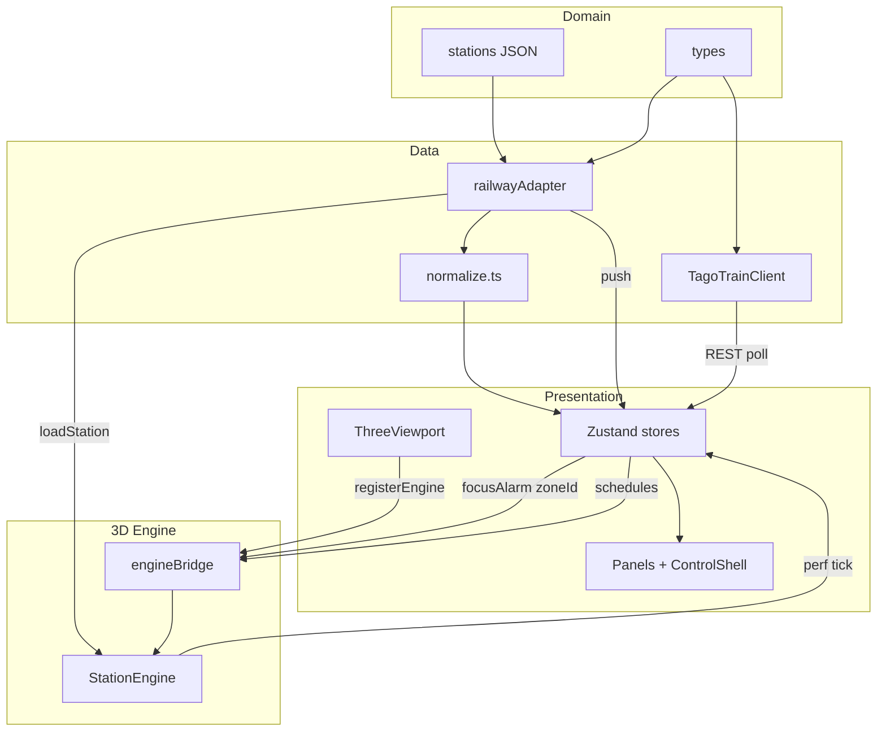

# 04. 기술 · 아키텍처 설계

> **문서 유형:** 프론트엔드 3단계 산출물  
> **근거:** `01-요구사항-범위-고정.md`, `03-UX-화면-설계.md`  
> **상세 참고:** `../TAGO-열차정보-API.md`, `../Three.js vs Fiber 사용.md`, `../Three.js 최적화 목록.md`  
> **목적:** 스택·경계·데이터 흐름·확장 구조를 구현 전에 고정

---

## 0. 한 줄 요약

**React + Zustand**는 패널·선택·알람 UI만, **순수 Three.js Engine**은 3D·연출·성능만.  
관제 데이터는 **`IRailwayStationAdapter`** 한 Interface로 Mock ↔  실서버 교체.  
역 확장은 **`data/stations/{id}/`** Config 추가만 — 코드 분기 없음.

---

## 1. 기술 스택 (확정)

| 레이어 | 선택 | 버전(현재) | 금지 / 미사용 |
|--------|------|------------|---------------|
| 빌드 | Vite + TypeScript | Vite 7, TS 5.8 | CRA |
| UI | React | 19 | |
| 3D | **순수 Three.js** | 0.178 | **R3F, Drei** |
| 상태 | **Zustand** | 5 | 3D 좌표를 React state에 저장 |
| 스타일 | **Tailwind CSS** (`@theme` gc 토큰) | Tailwind v4 + Vite | Global CSS only |
| 차트 | Recharts | 3 (P1) | |
| 백엔드 (프로젝트) | Spring 또는 NestJS + Socket.IO + Redis | PoC **풀백엔드 없음** | PoC에 백엔드 **필수 아님** |

### 1.1 ADR 요약

| 결정 | 이유 |
|------|------|
| 순수 Three | 장시간 rAF, dispose·InstancedMesh·draw call 직접 제어 |
| Zustand | 보일러플레이트 최소, 패널·필터에 적합 |
| Tailwind CSS | gc-twin-ops와 동일 스택; `@theme`으로 관제 다크 토큰 공유 |
| Adapter 분리 | PoC Mock → 프로젝트 NVR/WS **교체만** |
| TAGO 분리 클라이언트 | 전광판(TAGO)만 REST — 관제 알람·CCTV는 Adapter 구독과 분리 |
| Config-driven 역 | 서울–부산 KTX 역 확장 시 분기 방지 |

---

## 2. 레이어 아키텍처

### 2.1 컨셉 정합 (01·03 대비)

| 앱 컨셉 | 아키텍처 대응 | 검토 |
|---------|--------------|------|
| **3D가 주인공** — full-bleed 고정 | `ThreeViewport` + `StationEngine`이 항상 동일 영역; 패널은 overlay | 맞음 |
| **한 화면 관제** — 탭 6개 아님 | `ControlShell` 단일 셸 + `uiStore.rightPanelMode` | 맞음 |
| **알람 클릭 → fly-to → CCTV** | `alarmStore` → `engineBridge.focusAlarm` → `ZoneManager` + `CctvPanel` | 맞음 (`engineBridge` 필수) |
| **TAGO 전광판 + 3D 열차** | `TagoTrainClient` → `scheduleStore` → `TrainManager` (Adapter 밖) | 맞음 |
| **관제 Mock ↔ 실서버 교체** | `railwayAdapter` (`index.ts` 1줄) | 맞음 |
| **역 확장 = JSON 추가** | `data/stations/{id}/` + `registry.ts` | 맞음 |
| **혼잡 300%+ UI 금지** | `normalize.ts` (Data) → 패널·3D 색상 | 맞음 |
| **CCTV `<video>` 1개** | 영상은 React(`CctvPanel`), 마커만 3D(`DeviceManager`) | 맞음 |

**원칙:** React는 **선택 ID·패널 상태**만, 3D는 **좌표·lerp·rAF**만. 고빈도 값은 React state에 넣지 않는다 (§4).

### 2.2 레이어 구조 (의존 방향)

```text
┌─────────────────────────────────────────────────────────────────────────┐
│ Domain — 공통 계약·정적 설정 (코드 분기 없이 기차역 추가)                      │
│  types/station · types/events · types/tago                              │
│  data/stations/{id}/ config · devices · tracks · scenarios · traffic      │
└───────────────────────────────┬─────────────────────────────────────────┘
                                │ registry / import (Mock) · Socket (프로젝트)
                                ▼
┌─────────────────────────────────────────────────────────────────────────┐
│ Data Layer                                                              │
│  railwayAdapter  IRailwayStationAdapter                                   │
│    PoC: MockRailwayAdapter  /  프로젝트: SocketRailwayAdapter             │
│  TagoTrainClient — 전광판 REST (Adapter 밖)                             │
│  normalize.ts — NF-09 혼잡·위험 정규화                                   │
└───────────────┬───────────────────────────────┬─────────────────────────┘
                │ 구독·스냅샷 (저빈도)            │ loadStation() 시 config 조회
                ▼                               ▼
┌───────────────────────────────┐   ┌─────────────────────────────────────┐
│ Presentation (React)          │   │ 3D Engine (Three.js — state 밖)      │
│  ControlShell · HeaderBar     │   │  StationEngine · managers           │
│  OverlayPanel · Panels        │   │  Zone / Train / Device / (P1) Heatmap│
│  PerfWidget · ThreeViewport   │   │                                     │
│  Zustand: ui·alarm·device·    │   │                                     │
│    schedule·perf              │   │                                     │
│  hooks: useAlarms ·           │   │                                     │
│    useTrainSchedule · …       │   │                                     │
└───────────────┬───────────────┘   └──────────────────▲──────────────────┘
                │                                      │
                │         engineBridge                 │
                │  (flyTo · focusAlarm · setSchedules) │
                └──────────────────────────────────────┘
```

| 화살표 | 의미 |
|--------|------|
| Domain → Data | Mock는 JSON·registry, 프로젝트는 Socket — **UI는 출처를 모름** |
| Data → Presentation | `subscribeAlarms` 등 push → Zustand → 패널 |
| Data → 3D | `loadStation()`이 **adapter**로 config·devices·tracks 로드 (JSON 직접 X) |
| Presentation ↔ 3D | **`engineBridge`만** — React가 Engine 인스턴스 직접 보유 금지 |
| TAGO | Data → `scheduleStore` → 패널 표시 + `engineBridge`/`TrainManager` 연출 |

### 2.3 시나리오별 플로우 (P0)

**S1 — 평시 (전광판 + 열차)**

```text
TagoTrainClient.fetch → scheduleStore → TrainSchedulePanel
                                      → engineBridge → TrainManager (진입·정차 연출)
MockRailwayAdapter.subscribeSensors → (P1) HeatmapManager
PerfWidget ← engineBridge ← StationEngine (rAF)
```

**S2 — 안전선 침범**

```text
MockRailwayAdapter.subscribeAlarms → alarmStore → AlarmPanel (자동 표시)
사용자 클릭 → uiStore (selectedAlarmId, rightPanelMode=cctv)
           → engineBridge.focusAlarm → flyTo + 안전선 강조
           → CctvPanel (devices.json streamUrl, video 1개)
```

**S3 — 화장실 위급**

```text
subscribeAlarms + subscribeToilet → alarmStore + deviceStore
클릭 → engineBridge.focusAlarm → RestroomPanel + flyTo
```

세 시나리오 모두 **Adapter 한 줄로 Mock→실서버 교체** 가능. TAGO만 별도 REST.

### 2.4 데이터 흐름 (요약)



---

## 3. 디렉터리 구조

### 3.1 현재 (M0 스캐폴드 완료)

```text
src/
├── adapters/
│   ├── types.ts              # IRailwayStationAdapter (골격)
│   ├── MockRailwayAdapter.ts # PoC Mock (JSON·시나리오)
│   └── TagoTrainClient.ts    # 빈 구현
├── components/
│   ├── layout/
│   │   ├── ControlShell.tsx  # 셸 골격
│   │   └── HeaderBar.tsx     # placeholder
│   └── panels/
│       ├── AlarmPanel.tsx
│       ├── TrainSchedulePanel.tsx
│       └── CctvPanel.tsx     # placeholder
├── data/stations/seoul/
│   ├── config.json           # 최소 골격
│   └── devices.json
├── stores/
│   └── uiStore.ts            # 비어 있음
├── styles/global.css         # Tailwind + @theme 토큰
├── three/
│   ├── ThreeViewport.tsx     # placeholder div
│   ├── engine/StationEngine.ts
│   └── managers/             # Zone, Train, Device — 골격
├── types/                    # 골격
├── App.tsx
└── main.tsx
```

### 3.2 목표 (M3 P0 완료 시)

```text
src/
├── adapters/
│   ├── types.ts
│   ├── index.ts              # singleton export
│   ├── MockRailwayAdapter.ts
│   ├── SocketRailwayAdapter.ts  # (P2 스텁)
│   └── TagoTrainClient.ts
├── components/
│   ├── layout/
│   │   ├── ControlShell.tsx
│   │   ├── HeaderBar.tsx
│   │   └── OverlayPanel.tsx     # gc-twin-ops 패턴
│   └── panels/
│       ├── AlarmPanel.tsx
│       ├── TrainSchedulePanel.tsx
│       ├── CctvPanel.tsx
│       ├── RestroomPanel.tsx    # P0 (S3)
│       └── PerfWidget.tsx
├── data/stations/seoul/
│   ├── config.json              # zones, cameraPresets
│   ├── devices.json             # 21 CCTV 메타
│   ├── tracks.json              # 열차 스플라인
│   └── scenarios.json           # 데모 알람 스크립트 (선택)
├── hooks/
│   ├── useAlarms.ts
│   ├── useTrainSchedule.ts
│   ├── useRailwayAdapter.ts
│   └── useKeyboardShortcuts.ts
├── stores/
│   ├── uiStore.ts
│   ├── alarmStore.ts
│   ├── deviceStore.ts
│   ├── scheduleStore.ts
│   └── perfStore.ts
├── three/
│   ├── ThreeViewport.tsx        # Engine mount/dispose
│   ├── engine/
│   │   ├── StationEngine.ts
│   │   └── engineBridge.ts      # React ↔ Engine 단일 접점
│   └── managers/
│       ├── ZoneManager.ts
│       ├── TrainManager.ts
│       ├── DeviceManager.ts
│       └── HeatmapManager.ts    # P1
└── types/
    ├── station.ts
    ├── events.ts
    └── tago.ts
```

### 3.3 파일 책임 (핵심만)

| 파일 | 책임 | React? |
|------|------|--------|
| `ControlShell.tsx` | 레이아웃, overlay pointer-events | 예 |
| `ThreeViewport.tsx` | canvas mount, Engine 생성/파괴 | 예 (경계) |
| `StationEngine.ts` | rAF, render, manager 조율 | 아니오 |
| `engineBridge.ts` | `flyTo`, `highlightZone` imperative API | 아니오 |
| `uiStore.ts` | 패널·선택·구역 (03 §4.2) | 예 |
| `MockRailwayAdapter.ts` | 알람·센서·재실 Mock 스트림 | 아니오 |
| `TagoTrainClient.ts` | TAGO REST fetch | 아니오 |

---

## 4. React ↔ Three 경계

### 4.1 역할 분담

| React (Zustand) | Three (Engine) |
|-----------------|----------------|
| 패널 open/close, `rightPanelMode` | 열차 progress, lerp |
| 알람 목록, 필터, 미확인 count | 안전선·히트맵 material 색 |
| `selectedZoneId`, `selectedAlarmId` | `flyTo`, OrbitControls |
| TAGO 스케줄 **목록** (패널 표시) | 스케줄 → 연출 스케줄러 (TrainManager) |
| CCTV `<video>` src URL | CCTV 마커 InstancedMesh 위치 |
| 검색어, CSV 기간 (P1) | dispose, frustum culling, LOD |

### 4.2 금지 목록

```typescript
// 금지 — 매 프레임 React 리렌더
setState({ trainX, trainY, trainZ })
useFrame(() => setProgress(...))  // R3F 패턴 자체 미사용

// 금지 — 3D 객체를 React props로 전달
<Train mesh={trainMesh} />

// 허용 — 선택 ID만 넘기고 Engine이 조회
uiStore.setState({ selectedAlarmId: 'al-001' })
engineBridge.focusAlarm('al-001')
```

### 4.3 브리지 패턴 (`engineBridge.ts`)

React가 Engine 인스턴스를 직접 들고 있지 않게 **단일 모듈**로 감쌈.

#### 4.3.1 기본 API

```typescript
// three/engine/engineBridge.ts
let activeEngine: StationEngine | null = null
let generation = 0

export function registerEngine(instance: StationEngine | null): number {
  if (activeEngine && activeEngine !== instance) {
    activeEngine.stop()
    activeEngine.dispose()
    activeEngine = null
  }
  activeEngine = instance
  if (instance) generation += 1
  return generation
}

/** cleanup 시 자기 인스턴스일 때만 해제 — Strict Mode 이중 mount 방어 */
export function unregisterEngine(instance: StationEngine): void {
  if (activeEngine === instance) {
    activeEngine = null
  }
}

export function getEngineGeneration(): number {
  return generation
}

function withEngine<T>(fn: (eng: StationEngine) => T): T | undefined {
  const eng = activeEngine
  if (!eng || eng.disposed) return undefined
  return fn(eng)
}

export function flyToZone(zoneId: string) {
  withEngine((eng) => eng.zoneManager.flyTo(zoneId))
}

export function focusAlarm(event: AlarmEvent) {
  withEngine((eng) => {
    eng.zoneManager.flyTo(event.zoneId)
    eng.zoneManager.highlight(event.zoneId, event.type)
    if (event.deviceId) eng.deviceManager.pulse(event.deviceId)
  })
}
```

```typescript
// StationEngine — dispose 후 호출 무시
class StationEngine {
  disposed = false
  dispose(): void {
    if (this.disposed) return
    this.disposed = true
    this.stop()
    // renderer, geometry, material 해제 …
  }
}
```

```typescript
// ThreeViewport.tsx — 유일한 생성 지점
useEffect(() => {
  const container = containerRef.current
  if (!container) return

  const eng = new StationEngine(container)
  registerEngine(eng)
  eng.start()

  return () => {
    unregisterEngine(eng)  // 다른 인스턴스로 덮였으면 bridge 건드리지 않음
    eng.dispose()
  }
}, [])
```

#### 4.3.2 M1 리스크 — 레이스·GC 누수 (외부 리뷰 + 프로젝트 판단)

**리스크 (동의):** React 19 Strict Mode 이중 mount, 또는 재마운트 시 **dispose 전에 새 Engine이 register**되면 WebGL·geometry 누수.

**판단:** PoC에서 UUID 싱글톤까지는 **과설계**. 아래 3줄이면 충분하다.

| 규칙 | 구현 |
|------|------|
| register 전 | 기존 `activeEngine` 있으면 **먼저 stop + dispose** |
| unregister | `activeEngine === instance`일 때만 `null` |
| bridge 호출 | `eng.disposed` 체크 — 해제된 인스턴스에 imperative 호출 금지 |

**금지:** AlarmPanel 등에서 `StationEngine` 참조를 **클로저에 캡처**해 두지 않는다. 항상 `engineBridge.*` 경유.

```typescript
// 금지 클로저에 engine 보관
const eng = getEngine()
setTimeout(() => eng.flyTo(...), 1000)

// 권장 — generation 또는 bridge 함수
setTimeout(() => flyToZone(zoneId), 1000)
```

```typescript
// AlarmPanel — 클릭 시
const onSelectAlarm = (alarm: AlarmEvent) => {
  uiStore.getState().selectAlarm(alarm)
  focusAlarm(alarm)
}
```

### 4.4 React → Engine 동기화 규칙

| uiStore 변경 | Engine 반응 | 트리거 위치 |
|--------------|-------------|-------------|
| `selectedZoneId` | `flyToZone` / 프리셋 | HeaderBar, 3D pick |
| `selectedAlarmId` | `focusAlarm` | AlarmPanel |
| (scheduleStore) 도착 임박 편 | `TrainManager.schedule` | hook effect, **초기 1회+갱신** |
| sensor push (Adapter) | 버퍼 → rAF tick | Engine 내부 |

**원칙:** `useEffect`로 uiStore 구독 시 **의존성은 id만**. 좌표·progress는 구독하지 않는다.

### 4.6 Overlay · pointer-events (03 §11.1)

Floating 패널과 3D Orbit **충돌 방지** — CSS 1차, Store 2차.

```text
.app-shell__overlay          pointer-events: none
.overlay-panel__shell        pointer-events: none   ← 글래스·여백 (Orbit 통과)
.overlay-panel__content      pointer-events: auto   ← 카드·버튼·스크롤만
.three-viewport canvas       pointer-events: auto
```

```typescript
// uiStore — Orbit 2차 안전장치
isPointerOverPanel: boolean
setPointerOverPanel: (v: boolean) => void

// OverlayPanel content wrapper
onPointerEnter={() => setPointerOverPanel(true)}
onPointerLeave={() => setPointerOverPanel(false)}
```

```typescript
// StationEngine — OrbitControls pointerdown
if (uiStore.getState().isPointerOverPanel) return
```

| 파일 | 책임 |
|------|------|
| `OverlayPanel.tsx` | shell/content DOM 분리 |
| `uiStore.ts` | `isPointerOverPanel` |
| `StationEngine.ts` | Orbit 시작 전 store 조회 |

### 4.7 성능 위젯 (perfStore)

| 항목 | 규칙 |
|------|------|
| 수집 | `renderer.info` 매 rAF |
| React 반영 | **최대 4Hz** throttle (250ms) |
| 저장 | `perfStore`, Zustand |

---

## 5. Zustand 스토어 설계

### 5.1 uiStore (`03-UX` §4.2 구현)

```typescript
type RightPanelMode = 'schedule' | 'cctv' | 'restroom'

interface UiState {
  leftPanelOpen: boolean
  rightPanelOpen: boolean
  rightPanelMode: RightPanelMode
  selectedZoneId: string | null
  selectedAlarmId: string | null
  selectedDeviceId: string | null
  isPointerOverPanel: boolean

  toggleLeftPanel: () => void
  toggleRightPanel: () => void
  setZone: (zoneId: string | null) => void
  selectAlarm: (alarm: AlarmEvent) => void
  clearFocus: () => void
  setRightPanelMode: (mode: RightPanelMode) => void
  setPointerOverPanel: (v: boolean) => void
}
```

**selectAlarm 구현 규칙**

```typescript
selectAlarm: (alarm) => {
  set({
    selectedAlarmId: alarm.id,
    selectedDeviceId: alarm.deviceId ?? null,
    selectedZoneId: alarm.zoneId,
    leftPanelOpen: true,
    rightPanelMode: 'cctv',
    rightPanelOpen: true,
  })
}
```

### 5.2 alarmStore (`05` §8.1)

Adapter push를 React 목록으로 반영. **`append` 금지 → `upsert` 필수.**

```typescript
interface AlarmState {
  items: AlarmEvent[]
  unackedCount: number
  upsert: (e: AlarmEvent) => void      // id 기준 덮어쓰기
  setAll: (items: AlarmEvent[]) => void  // mergeById 후 replace
  ack: (id: string) => void
}
```

```typescript
upsert: (e) => set((s) => {
  const idx = s.items.findIndex((x) => x.id === e.id)
  const items =
    idx >= 0
      ? s.items.map((x, i) => (i === idx ? e : x))
      : [e, ...s.items]
  return { items, unackedCount: countUnacked(items) }
})
```

- `useAlarms`: **subscribe 먼저** → buffer → `getActiveAlarms` → `mergeById` → `setAll` (`05` §7.1)
- 미확인 count는 `items.filter(!acked)` 파생 또는 store 유지

### 5.5 deviceStore (`05` §8.3)

`DeviceMetadata`(정적) + `CctvStatusEvent`(동적) 병합.

```typescript
type CctvRuntimeStatus = 'ONLINE' | 'CONNECTING' | 'OFFLINE' | 'ERROR'

type DeviceRuntime = DeviceMetadata & {
  cctvStatus: CctvRuntimeStatus  // hydrate 시 기본 ONLINE
}

interface DeviceState {
  byId: Record<string, DeviceRuntime>
  hydrate: (devices: DeviceMetadata[]) => void
  patchCctvStatus: (e: CctvStatusEvent) => void
  get: (deviceId: string) => DeviceRuntime | undefined
}
```

- `useDevices`: `getDevices` → `hydrate`, `subscribeCctvStatus` → `patchCctvStatus`
- `DeviceManager`: `cctvStatus !== 'ONLINE'` → 회색 마커, picking **선택적 비활성**
- `CctvPanel`: OFFLINE이면 `streamUrl` 로드 안 함

### 5.3 scheduleStore

```typescript
type ScheduleStatus = 'idle' | 'loading' | 'fresh' | 'stale' | 'error'

interface ScheduleState {
  departures: TagoTrainRow[]
  arrivals: TagoTrainRow[]
  status: ScheduleStatus
  error: string | null
  lastFetchedAt: number | null
  fetchSchedules: (stationId: string) => Promise<void>
}
```

- TAGO만 사용 — **Adapter에 넣지 않음** (관제 WS와 독립)
- **Mock fallback 금지** (`01` 합의) — 실패·타임아웃 시 **마지막 성공 목록 유지** (`stale`)
- `TagoTrainClient`: `AbortController` **2s 타임아웃**
- 첫 로드(`lastFetchedAt === null`) 실패만 `error` + 스켈레톤 3행
- `TrainManager`는 `scheduleStore` 또는 `TagoTrainClient` 결과를 **구독 callback**으로 수신

```typescript
// fetchSchedules 의사코드
const prev = get()
try {
  const rows = await client.fetchArrivals(nodeId, { signal, timeoutMs: 2000 })
  set({ arrivals: rows, status: 'fresh', lastFetchedAt: Date.now(), error: null })
} catch (e) {
  if (prev.lastFetchedAt) {
    set({ status: 'stale', error: '갱신 지연' }) // 목록 유지
  } else {
    set({ status: 'error', error: 'TAGO 연결 확인' })
  }
}
```

### 5.4 perfStore

```typescript
interface PerfState {
  fps: number
  drawCalls: number
  triangles: number
  setStats: (s: { fps: number; drawCalls: number; triangles: number }) => void
}
```

---

## 6. Adapter 설계

### 6.1 원칙

```text
3D Engine ──모름──► 데이터가 Mock인지 Socket인지
React Panels ──모름──► 동일
오직 Adapter 구현체만 출처를 안다
```

PoC 앱 시작:

```typescript
// adapters/index.ts
import { MockRailwayAdapter } from './MockRailwayAdapter'

export const railwayAdapter: IRailwayStationAdapter = new MockRailwayAdapter()

// 프로젝트 전환 시 한 줄:
// export const railwayAdapter = new SocketRailwayAdapter({ url: WS_URL })
```

### 6.2 IRailwayStationAdapter (계약)

```typescript
type Unsubscribe = () => void

export interface IRailwayStationAdapter {
  // ── 정적 (Config) ──
  getStationConfig(stationId: string): Promise<StationConfig>
  getDevices(stationId: string): Promise<DeviceMetadata[]>
  getTracks(stationId: string): Promise<TrackConfig | null>

  // ── 실시간 push (PoC: interval / 시나리오) ──
  subscribeAlarms(cb: (event: AlarmEvent) => void): Unsubscribe
  subscribeSensors(cb: (event: SensorEvent) => void): Unsubscribe
  subscribeToilet(cb: (event: ToiletEvent) => void): Unsubscribe
  subscribeCctvStatus(cb: (event: CctvStatusEvent) => void): Unsubscribe

  // ── 스냅샷 (패널 초기 로드) ──
  getActiveAlarms(): Promise<AlarmEvent[]>
  getSensorSnapshot(zoneId?: string): Promise<SensorSnapshot[]>
  getToiletSnapshot(): Promise<ToiletStallState[]>

  // ── P1 시계열 ──
  getTrafficHistory?(query: TrafficQuery): Promise<TrafficSeries[]>

  // ── 생명주기 ──
  connect(): Promise<void>
  disconnect(): void
}
```

**Adapter에 넣지 않는 것:** TAGO 열차 시간표 → `TagoTrainClient`

### 6.3 MockRailwayAdapter (PoC)

| 메서드 | 구현 방식 |
|--------|-----------|
| `getStationConfig` | `import config.json` (dynamic `import.meta.glob` 확장) |
| `getDevices` | `devices.json` |
| `subscribeAlarms` | `scenarios.json` 타임라인 + `setInterval` 랜덤 1건 |
| `subscribeSensors` | 구역별 0~100% 순환, **NF-09** 준수 |
| `getTrafficHistory` | 고정 시계열 JSON |

데모 리허설: `scenarios.json`에 S2 안전선 침범 `delayMs: 45000` 등.

### 6.4 SocketRailwayAdapter (프로젝트 스텁)

```typescript
export class SocketRailwayAdapter implements IRailwayStationAdapter {
  constructor(private readonly options: { url: string; stationId: string }) {}

  connect() {
    // Socket.IO connect
    // 'alarm' | 'sensor' | 'toilet' | 'cctv' → 동일 cb 시그니처로 fan-out
  }
}
```

| Mock | Socket |
|------|--------|
| `setInterval` | `socket.on('alarm')` |
| JSON 파일 | Spring 또는 NestJS → Redis → WS |
| `streamUrl` 로컬 mp4 | NVR WebRTC/HLS URL |

**프론트 변경 범위:** `adapters/index.ts` 1줄 + (선택) env `VITE_WS_URL`

### 6.5 TagoTrainClient (별도)

```typescript
export class TagoTrainClient {
  constructor(
    private baseUrl = '/api/tago',
    private timeoutMs = 2000,
  ) {}

  fetchDepartures(nodeId: string, params?: TagoQuery): Promise<TagoTrainRow[]>
  fetchArrivals(nodeId: string, params?: TagoQuery): Promise<TagoTrainRow[]>
}
```

| 옵션 | 값 |
|------|-----|
| 타임아웃 | **2s** (`AbortController`) |
| 실패 시 | **throw** → `scheduleStore`가 stale/error 분기 (Mock 데이터 **생성 안 함**) |
| 데모 준비 | `App` mount 시 `fetchSchedules` 1회 prefetch |

| 환경 | URL |
|------|-----|
| 개발 | Vite proxy `/api/tago` → `apis.data.go.kr/1613000/TrainInfo` |
| 프로덕션 | Spring 또는 NestJS 프록시 (키 서버 보관) |

#### 6.5.1 M1 리스크 — fetch와 메인 스레드 (외부 리뷰 + 프로젝트 판단)

**리스크 (부분 동의):** TAGO 주기 fetch 실패 시 프레임 드롭이 **성능 위젯에 노출**될 수 있다.

**판단:** `fetch` + `AbortController`는 **네트워크 I/O 비동기**라 CORS/타임아웃 자체가 메인 스레드를 장시간 블로킹하지는 않는다. TAGO 응답 JSON도 작다. **M1에서 Web Worker는 도입하지 않는다** — PoC 복잡도 대비 이득이 작다.

| M1 (채택) | P2 (확장 슬롯) |
|-----------|----------------|
| `fetchSchedules` **최소 60s** 주기 (수동 새로고침은 즉시) | `ITrainScheduleTransport` Worker 구현 |
| stale 시 **재시도 백오프** (5s → 15s) | NF-16 대용량 JSON 파싱 Worker |
| `App` mount **prefetch 1회** | |
| 응답 `json()` 후 store 갱신만 — rAF와 **동시 실행 OK** | |

```typescript
// adapters/ITrainScheduleTransport.ts — M1은 동일 파일 내 구현, P2 교체
export interface ITrainScheduleTransport {
  fetchDepartures(nodeId: string, signal?: AbortSignal): Promise<TagoTrainRow[]>
  fetchArrivals(nodeId: string, signal?: AbortSignal): Promise<TagoTrainRow[]>
}

export class TagoTrainClient implements ITrainScheduleTransport { /* … */ }
// P2: class TagoTrainWorkerTransport implements ITrainScheduleTransport { … }
```

---

## 7. 데이터 흐름

### 7.1 TAGO → 3D 열차 연출

```text
TagoTrainClient.fetchArrivals()
        ↓
scheduleStore (React 패널)
        ↓
TrainManager.setUpcoming(schedules)   ← engineBridge 또는 callback
        ↓
rAF: arriveAt - 25s → spawn, progress 0→1
```

### 7.2 Mock 알람 → UI + 3D

```text
MockRailwayAdapter.subscribeAlarms
        ↓
alarmStore.append
        ↓
AlarmPanel 리렌더
        ↓ (클릭)
uiStore.selectAlarm + engineBridge.focusAlarm
        ↓
ZoneManager.flyTo + highlight / DeviceManager.pulse
        ↓
CctvPanel (selectedDeviceId, streamUrl from devices.json)
```

**CctvPanel 영상 규칙 (03 §11.3, NF-03)**

| 규칙 | 구현 |
|------|------|
| 동시 decode | `<video>` **1개**만 `play()` |
| 썸네일 2~3 | `devices.json` `thumbnailUrl` — **JPEG ``** |
| 카메라 전환 | 이전 `video.pause(); video.removeAttribute('src'); video.load()` |
| 성능 | CCTV 모드에서도 FPS ≥30 (`perfStore` 모니터) |

```typescript
// devices.json 필드 추가
{ "deviceId": "sld-006", "streamUrl": "...", "thumbnailUrl": "/mock/sld-06.jpg" }
```

#### 7.2.1 M1 리스크 — 비디오 해제 타이밍 (외부 리뷰 + 프로젝트 판단)

**리스크 (동의):** `rightPanelMode !== 'cctv'` 또는 패널 접힘 시 DOM unmount만으로는 **디코더·버퍼가 남는** 경우가 많다.

**판단:** `CctvPanel` 내부에 **`useVideoStream` 훅**으로 생명주기를 고정한다. 카메라 전환·모드 이탈·unmount **3경로** 모두 동일 cleanup.

```typescript
// hooks/useVideoStream.ts
function releaseVideoElement(video: HTMLVideoElement) {
  video.pause()
  video.removeAttribute('src')
  video.load()
}

export function useVideoStream(
  videoRef: RefObject<HTMLVideoElement | null>,
  src: string | null,
  enabled: boolean,  // rightPanelMode === 'cctv' && streamUrl
) {
  useEffect(() => {
    const video = videoRef.current
    if (!video || !enabled || !src) {
      if (video) releaseVideoElement(video)
      return
    }
    video.src = src
    void video.play().catch(() => {})
    return () => releaseVideoElement(video)
  }, [src, enabled])
}
```

| 트리거 | `enabled` / `src` | cleanup |
|--------|-------------------|---------|
| 알람 → CCTV 모드 | `enabled=true`, `streamUrl` | — |
| 썸네일 클릭 (src 교체) | `src` 변경 | 이전 effect cleanup |
| Esc → 전광판 | `enabled=false` | **즉시 release** |
| `rightPanelOpen=false` | `CctvPanel` unmount | effect cleanup |

**규칙:** `<video>`는 `CctvPanel` **내부 1개**만 mount. 패널 밖에서 video ref 공유 **금지**.

### 7.3 센서 → 히트맵 (P1)

```text
subscribeSensors → Engine eventBuffer (Map)
        ↓
rAF tick (1회/프레임)
        ↓
HeatmapManager.setLevel(zoneId, 0~1)
```

---

## 8. 3D Engine 설계

### 8.1 StationEngine 생명주기

```typescript
class StationEngine {
  constructor(container: HTMLElement)
  async loadStation(stationId: string): Promise<void>
  start(): void          // rAF loop
  stop(): void
  dispose(): void        // renderer, geometry, material 전부

  readonly zoneManager: ZoneManager
  readonly trainManager: TrainManager
  readonly deviceManager: DeviceManager
}
```

**loadStation 순서** — 정적 데이터는 **Domain JSON 직접이 아니라 `railwayAdapter` 경유** (§2.2).

1. `adapter.getStationConfig` + `getDevices` + `getTracks`
2. staticRoot: 매스 박스 또는 GLB
3. safetyLine mesh (platform-56)
4. DeviceManager.instanced from devices
5. ZoneManager.registerPresets(config.zones)
6. TrainManager.bindTracks(tracks)

### 8.2 Scene Graph

```text
Scene
├── staticRoot       # 매스/GLB, 안전선
├── dynamicRoot      # 열차 mesh
├── devicesRoot      # InstancedMesh (CCTV icon)
└── overlayRoot      # 히트맵 plane (P1)
```

### 8.3 ZoneManager

```typescript
interface CameraPreset {
  id: string
  position: [number, number, number]
  target: [number, number, number]
  durationMs?: number
}

flyTo(zoneId: string): Promise<void>
highlight(zoneId: string, kind: AlarmKind): void
setOverview(): void
```

- fly-to 중 OrbitControls **일시 비활성**
- 완료 후 `uiStore`와 무관하게 camera target 유지

### 8.4 TrainManager

- 입력: `TagoTrainRow[]` + `tracks.json`
- 동시 active **최대 3편**
- phase: `approach | dwell | depart | done`
- React에는 **activeTrainCount** 정도만 (선택), 좌표 금지

### 8.5 DeviceManager

- CCTV·센서: `InstancedMesh` 또는 `Sprite`
- `pulse(deviceId)`: 이벤트 시 scale/emissive 1회
- 클릭 picking → `uiStore.setDevice(id)` + `rightPanelMode='cctv'`

---

## 9. 다역사 확장

### 9.1 규칙

```typescript
// 금지 — 역사별 코드 분기
if (stationId === 'SEOUL') { ... }

// 권장 — Config 기반
const config = await adapter.getStationConfig(stationId)
engine.loadFromConfig(config)
```

### 9.2 역 추가 체크리스트

| 파일 | 내용 |
|------|------|
| `data/stations/{id}/config.json` | `tagoNodeId`, zones, cameraPresets |
| `data/stations/{id}/devices.json` | CCTV·센서 좌표 |
| `data/stations/{id}/tracks.json` | (선택) 열차 경로 |
| `public/models/{id}.glb` | (프로젝트) 3D 에셋 |

```typescript
// MockRailwayAdapter
const configs = import.meta.glob('/src/data/stations/*/config.json')
```

`uiStore` 또는 헤더: `stationId` 전환 → `engine.loadStation(id)` + `scheduleStore.fetch`

### 9.3 역별 서비스 차이

견적: **역마다 설치 서비스가 다를 수 있음**.

- 공통: `DeviceMetadata.deviceType` enum
- 없는 설비: `devices.json` 빈 배열 → UI·3D 마커 **미생성**
- Adapter는 동일 Interface — 역별 필터는 Config

---

## 10. API · 환경 · 보안

| 변수 | 용도 |
|------|------|
| `VITE_TAGO_SERVICE_KEY` | 개발 TAGO (`.env`, git 제외) |
| `VITE_WS_URL` | (프로젝트) SocketRailwayAdapter |
| `VITE_TAGO_TIMEOUT_MS` | (선택) 기본 2000 |

| 모드 | 배포 | TAGO | 관제 데이터 |
|------|------|------|-------------|
| 로컬 개발 | `npm run dev` | Vite `/api/tago` proxy | MockRailwayAdapter |
| **PoC 웹 데모** | **train-twin.grapicar.com** (Grapicar) | **서버 TAGO 프록시** (키 서버 보관) | Mock |
| 프로젝트 납품 | 역사 **온프레미스** | Spring 또는 NestJS proxy | Socket + NVR |

PoC 웹 배포 시 프론트는 `vite build` 정적 산출물; TAGO 키는 **브라우저·번들에 넣지 않음**.

---

## 11. hooks 계약

| Hook | 역할 |
|------|------|
| `useRailwayAdapter()` | singleton 반환 |
| `useAlarms()` | subscribe + alarmStore upsert (`05` §8.1) |
| `useDevices()` | hydrate + subscribeCctvStatus → deviceStore |
| `useTrainSchedule(stationId)` | TAGO fetch, 주기 갱신 |
| `useKeyboardShortcuts()` | `Esc` → `uiStore.clearFocus` |
| `useVideoStream(ref, src, enabled)` | CCTV `<video>` mount·전환·unmount cleanup (§7.2.1) |
| `useEngineReady()` | `getEngineGeneration()` 변경 감지 (선택) |

---

## 12. 구현 상태 · 마일스톤 매핑

| 마일스톤 | 아키텍처 산출물 | 코드 상태 |
|----------|-----------------|-----------|
| **M0** 완료 | 폴더·스택·proxy | 스캐폴드만, Engine/Store 빈 껍데기 |
| **M1** | uiStore, OverlayPanel, TagoTrainClient, scheduleStore, Viewport placeholder, engineBridge 스텁 | **다음** |
| **M2** | MockRailwayAdapter, alarmStore, deviceStore, 패널 E2E (알람·CCTV·재실) | 대기 |
| **M3** | StationEngine, managers, engineBridge 실구현, PerfWidget, fly-to·열차 | 대기 |
| **M4** | HeatmapManager, getTrafficHistory, 통계 | P1 |

### 12.1 구현 순서 (패널 선행 · Viewport 마지막)

**원칙:** Adapter/Mock → Zustand → 패널은 Engine 없이 완성. 3D는 M3에서 `engineBridge.register`만 추가.

```text
[M1] 1. types + uiStore + OverlayPanel + ControlShell (full-bleed, viewport placeholder)
     2. engineBridge 스텁 — focusAlarm/flyToZone noop (disposed 체크 포함)
     3. TagoTrainClient + scheduleStore + TrainSchedulePanel
[M2] 4. MockRailwayAdapter subscribe → alarmStore·deviceStore
     5. AlarmPanel · CctvPanel(useVideoStream) · RestroomPanel · 구역 칩
     6. selectAlarm → engineBridge.focusAlarm (아직 noop) — 패널·스토어 E2E
[M3] 7. StationEngine + managers + engineBridge 실구현 + PerfWidget
     8. tracks.json · TrainManager · ZoneManager.flyTo — S1~S3 3D 완료
```

### 12.2 M2 → M3 연결 (패널 코드 변경 최소)

```text
config.json zones/cameraPresets (이미 M1~M2에서 uiStore·패널이 사용)
  → M3: ThreeViewport mount → engineBridge.register(StationEngine)
  → focusAlarm / flyToZone 이 noop → 실동작으로 전환
  → 기존 AlarmPanel·HeaderBar 로직은 그대로
```

---

## 13. M1 구현 리스크 요약

| # | 리스크 | 판단 | 대응 (절) |
|---|--------|------|-----------|
| 1 | engineBridge 레이스·GC 누수 | **동의** — Strict Mode 대비 필수 | §4.3.1 register/dispose/unregister |
| 2 | TAGO fetch → FPS 툭 | **부분 동의** — Worker는 P2 | §6.5.1 60s throttle + `ITrainScheduleTransport` 슬롯 |
| 3 | CCTV video 유령 스트림 | **동의** — React lifecycle 필수 | §7.2.1 `useVideoStream` 3경로 cleanup |

---

## 14. 테스트 · 검증 (PoC)

| 검증 | 방법 |
|------|------|
| React↔3D 경계 | React DevTools에서 rAF 중 리렌더 급증 없음 |
| Adapter 교체 | `index.ts`에서 클래스만 바꿔 패널 동작 동일 |
| 역 확장 | `devices.json`만 수정해 마커 수 변경 |
| NF-09 | Mock 센서가 100 초과 값 내지 않음 |
| Orbit 충돌 | 패널 콘텐츠 위에서 Orbit 미시작 (`isPointerOverPanel`) |
| TAGO stale | 2s 타임아웃 후 이전 목록 유지, Mock 스케줄 **미사용** |
| CCTV decode | 활성 video 1개, 썸네일 img만 — FPS 급락 없음 |
| dispose | 구역 전환·unmount 후 `renderer.info` 메모리 안정 |
| engineBridge | Strict Mode 2회 mount 후 WebGL context 1개, `disposed` 호출 무시 |
| video cleanup | CCTV→전광판 전환 후 `video.src === ''` |

---

## 15. 문서 관계

```text
01-요구사항     What / P0·P1
03-UX-화면      패널·상태·플로우
04-기술-아키텍처  How (본 문서) — 구현 시 1차 참조
05-API-데이터   Adapter·JSON·WS 계약
TAGO-열차정보   TagoTrainClient 전용 (../TAGO-열차정보-API.md)
```

---

## 16. 변경 이력

| 날짜 | 변경 |
|------|------|
| 2026-07-14 | 초안 — 스택, 레이어, 경계, Adapter, Store, Engine, 확장, M0~M3 매핑 |
| 2026-07-14 | §4.6 pointer-events 2단계, §5.3 TAGO stale, §6.5 timeout, §7.2 CCTV 1 decoder (`03` §11) |
| 2026-07-14 | §4.3.1 engineBridge lifecycle, §6.5.1 transport 슬롯, §7.2.1 useVideoStream, §13 M1 리스크 |
| 2026-07-14 | §5.2 alarmStore upsert, §5.5 deviceStore (`05` §8) |
| 2026-07-15 | 10절 배포 — PoC `train-twin.grapicar.com` vs 프로젝트 온프레미스 |
| 2026-07-15 | §12 재정렬 — 패널·스토어 M1~M2, Viewport·Engine M3, engineBridge 스텁 선행 |
| 2026-07-15 | `프로젝트-설계서.md` 제거 — 본 문서·`05`가 정본, Three.js 참고 문서만 `docs/`에 유지 |
| 2026-07-15 | §2 재작성 — 컨셉 정합 표, Domain/Data/3D 의존 수정, engineBridge·S1~S3 플로우, mermaid 보강 |
